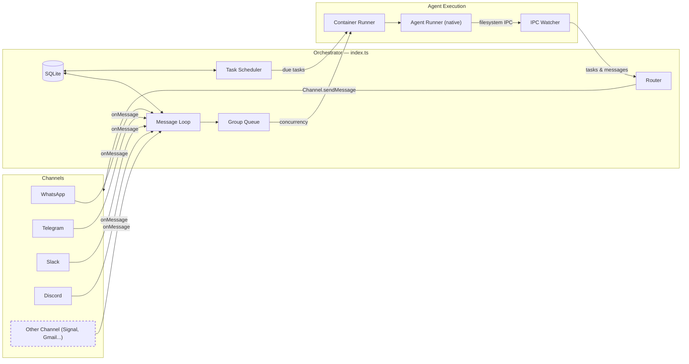

# NanoClaw Specification

A personal Claude assistant with multi-channel support, persistent memory per conversation, scheduled tasks, and multi-backend agent execution.

---

## Table of Contents

1. [Architecture](#architecture)
2. [Architecture: Channel System](#architecture-channel-system)
3. [Folder Structure](#folder-structure)
4. [Configuration](#configuration)
5. [Memory System](#memory-system)
6. [Session Management](#session-management)
7. [Message Flow](#message-flow)
8. [Commands](#commands)
9. [Scheduled Tasks](#scheduled-tasks)
10. [MCP Servers](#mcp-servers)
11. [Deployment](#deployment)
12. [Security Considerations](#security-considerations)

---

## Architecture

```
┌──────────────────────────────────────────────────────────────────────┐
│                           HOST (Linux)                                │
│                     (Main Node.js Process)                            │
├──────────────────────────────────────────────────────────────────────┤
│                                                                       │
│  ┌──────────────────┐                  ┌────────────────────┐        │
│  │ Channels         │─────────────────▶│   SQLite Database  │        │
│  │ (self-register   │◀────────────────│   (messages.db)    │        │
│  │  at startup)     │  store/send      └─────────┬──────────┘        │
│  └──────────────────┘                            │                   │
│                                                   │                   │
│         ┌─────────────────────────────────────────┘                   │
│         │                                                             │
│         ▼                                                             │
│  ┌──────────────────┐    ┌──────────────────┐    ┌───────────────┐   │
│  │  Message Loop    │    │  Scheduler Loop  │    │  IPC Watcher  │   │
│  │  (polls SQLite)  │    │  (checks tasks)  │    │  (file-based) │   │
│  └────────┬─────────┘    └────────┬─────────┘    └───────────────┘   │
│           │                       │                                   │
│           └───────────┬───────────┘                                   │
│                       │ spawns agent process                          │
│                       ▼                                               │
├──────────────────────────────────────────────────────────────────────┤
│                   AGENT RUNNER (Native Process)                       │
├──────────────────────────────────────────────────────────────────────┤
│  ┌──────────────────────────────────────────────────────────────┐    │
│  │  Backend: claude-code (Agent SDK) or codex (OpenAI proxy)     │    │
│  │                                                                │    │
│  │  Working directory: groups/{name}/                             │    │
│  │  Env-based paths:                                              │    │
│  │    • NANOCLAW_GROUP_DIR → groups/{name}/                       │    │
│  │    • NANOCLAW_GLOBAL_DIR → groups/global/                       │    │
│  │    • NANOCLAW_IPC_DIR → data/ipc/{group}/                      │    │
│  │    • NANOCLAW_EXTRA_DIR → groups/{name}/extra/                 │    │
│  │                                                                │    │
│  │  Tools (configurable per-group via containerConfig):           │    │
│  │    • Bash, Read, Write, Edit, Glob, Grep (file operations)    │    │
│  │    • WebSearch, WebFetch (internet access)                     │    │
│  │    • mcp__nanoclaw__* (IPC tools)                              │    │
│  │    • mcp__signet__* (memory tools)                             │    │
│  │                                                                │    │
│  └──────────────────────────────────────────────────────────────┘    │
│                                                                       │
└───────────────────────────────────────────────────────────────────────┘
```

### Technology Stack

| Component | Technology | Purpose |
|-----------|------------|---------|
| Channel System | Channel registry (`src/channels/registry.ts`) | Channels self-register at startup |
| Message Storage | SQLite (better-sqlite3) | Store messages for polling |
| Agent Runner | Native Node.js process | Spawns agent with env-based path isolation |
| Agent Backend | claude-code (Agent SDK) or codex (OpenAI proxy) | Multi-backend agent execution |
| Browser Automation | agent-browser + Chromium | Web interaction and screenshots |
| Runtime | Node.js 20+ | Host process for routing and scheduling |

---

## Architecture: Channel System

Channels are added via [Claude Code skills](https://code.claude.com/docs/en/skills) (e.g., `/add-telegram`, `/add-whatsapp`). Telegram is included by default; other channels (WhatsApp, Slack, Discord, Gmail) are installed on demand. Channels self-register at startup; installed channels with missing credentials emit a WARN log and are skipped.

### System Diagram



### Channel Registry

The channel system is built on a factory registry in `src/channels/registry.ts`:

```typescript
export type ChannelFactory = (opts: ChannelOpts) => Channel | null;

const registry = new Map<string, ChannelFactory>();

export function registerChannel(name: string, factory: ChannelFactory): void {
  registry.set(name, factory);
}

export function getChannelFactory(name: string): ChannelFactory | undefined {
  return registry.get(name);
}

export function getRegisteredChannelNames(): string[] {
  return [...registry.keys()];
}
```

Each factory receives `ChannelOpts` (callbacks for `onMessage`, `onChatMetadata`, and `registeredGroups`) and returns either a `Channel` instance or `null` if that channel's credentials are not configured.

### Channel Interface

Every channel implements this interface (defined in `src/types.ts`):

```typescript
interface Channel {
  name: string;
  connect(): Promise<void>;
  sendMessage(jid: string, text: string): Promise<void>;
  isConnected(): boolean;
  ownsJid(jid: string): boolean;
  disconnect(): Promise<void>;
  setTyping?(jid: string, isTyping: boolean): Promise<void>;
  syncGroups?(force: boolean): Promise<void>;
}
```

### Self-Registration Pattern

Channels self-register using a barrel-import pattern:

1. Each channel skill adds a file to `src/channels/` (e.g. `whatsapp.ts`, `telegram.ts`) that calls `registerChannel()` at module load time:

   ```typescript
   // src/channels/whatsapp.ts
   import { registerChannel, ChannelOpts } from './registry.js';

   export class WhatsAppChannel implements Channel { /* ... */ }

   registerChannel('whatsapp', (opts: ChannelOpts) => {
     // Return null if credentials are missing
     if (!existsSync(authPath)) return null;
     return new WhatsAppChannel(opts);
   });
   ```

2. The barrel file `src/channels/index.ts` imports all channel modules, triggering registration:

   ```typescript
   import './whatsapp.js';
   import './telegram.js';
   // ... each skill adds its import here
   ```

3. At startup, the orchestrator (`src/index.ts`) loops through registered channels and connects whichever ones return a valid instance:

   ```typescript
   for (const name of getRegisteredChannelNames()) {
     const factory = getChannelFactory(name);
     const channel = factory?.(channelOpts);
     if (channel) {
       await channel.connect();
       channels.push(channel);
     }
   }
   ```

### Key Files

| File | Purpose |
|------|---------|
| `src/channels/registry.ts` | Channel factory registry |
| `src/channels/index.ts` | Barrel imports that trigger channel self-registration |
| `src/types.ts` | `Channel` interface, `ChannelOpts`, message types |
| `src/index.ts` | Orchestrator — instantiates channels, runs message loop |
| `src/router.ts` | Finds the owning channel for a JID, formats messages |

### Adding a New Channel

To add a new channel, contribute a skill to `.claude/skills/add-<name>/` that:

1. Adds a `src/channels/<name>.ts` file implementing the `Channel` interface
2. Calls `registerChannel(name, factory)` at module load
3. Returns `null` from the factory if credentials are missing
4. Adds an import line to `src/channels/index.ts`

See existing skills (`/add-whatsapp`, `/add-telegram`, `/add-slack`, `/add-discord`, `/add-gmail`) for the pattern.

---

## Folder Structure

```
nanoclaw/
├── CLAUDE.md                      # Project context for Claude Code
├── docs/
│   ├── SPEC.md                    # This specification document
│   ├── REQUIREMENTS.md            # Architecture decisions
│   └── SECURITY.md                # Security model
├── README.md                      # User documentation
├── package.json                   # Node.js dependencies
├── tsconfig.json                  # TypeScript configuration
├── .mcp.json                      # MCP server configuration (reference)
├── .gitignore
│
├── src/
│   ├── index.ts                   # Orchestrator: state, message loop, agent invocation
│   ├── channels/
│   │   ├── registry.ts            # Channel factory registry
│   │   └── index.ts               # Barrel imports for channel self-registration
│   ├── ipc.ts                     # IPC watcher and task processing
│   ├── router.ts                  # Message formatting and outbound routing
│   ├── config.ts                  # Configuration constants
│   ├── types.ts                   # TypeScript interfaces (includes Channel)
│   ├── logger.ts                  # Pino logger setup
│   ├── db.ts                      # SQLite database initialization and queries
│   ├── group-queue.ts             # Per-group queue with global concurrency limit
│   ├── mount-security.ts          # Mount allowlist validation
│   ├── models.ts                  # Model registry for /model command
│   ├── task-scheduler.ts          # Runs scheduled tasks when due
│   └── container-runner.ts        # Spawns native agent processes
│
├── container/
│   └── agent-runner/              # Agent runner (native Node.js process)
│       ├── package.json
│       ├── tsconfig.json
│       └── src/
│           ├── index.ts           # Entry point (query loop, IPC polling, session resume)
│           ├── ipc-mcp-stdio.ts   # Stdio-based MCP server for host communication
│           ├── backend.ts         # Backend abstraction (AgentBackend interface)
│           └── backends/          # Backend implementations (claude-code, codex)
│
├── dist/                          # Compiled JavaScript (gitignored)
│
├── .claude/
│   └── skills/
│       ├── setup/SKILL.md              # /setup - First-time installation
│       ├── customize/SKILL.md          # /customize - Add capabilities
│       ├── debug/SKILL.md              # /debug - Container debugging
│       ├── add-telegram/SKILL.md       # /add-telegram - Telegram channel
│       ├── add-gmail/SKILL.md          # /add-gmail - Gmail integration
│       ├── add-voice-transcription/    # /add-voice-transcription - Whisper
│       ├── x-integration/SKILL.md      # /x-integration - X/Twitter
│       └── add-parallel/SKILL.md       # /add-parallel - Parallel agents
│
├── groups/
│   ├── CLAUDE.md                  # Global memory (all groups read this)
│   ├── {channel}_main/             # Main control channel (e.g., whatsapp_main/)
│   │   ├── CLAUDE.md              # Main channel memory
│   │   └── logs/                  # Task execution logs
│   └── {channel}_{group-name}/    # Per-group folders (created on registration)
│       ├── CLAUDE.md              # Group-specific memory
│       ├── logs/                  # Task logs for this group
│       └── *.md                   # Files created by the agent
│
├── store/                         # Local data (gitignored)
│   └── messages.db                # SQLite database (messages, chats, scheduled_tasks, task_run_logs, registered_groups, sessions, router_state)
│
├── data/                          # Application state (gitignored)
│   ├── sessions/                  # Per-group session data (.claude/ dirs with JSONL transcripts)
│   ├── agents.json                # Cross-instance agent registry (per-host, not in git)
│   └── ipc/                       # Agent IPC (messages/, tasks/)
│
└── logs/                          # Runtime logs (gitignored)
    ├── nanoclaw.log               # Host stdout
    └── nanoclaw.error.log         # Host stderr
```

---

## Configuration

Configuration constants are in `src/config.ts`:

```typescript
import path from 'path';

export const ASSISTANT_NAME = process.env.ASSISTANT_NAME || 'Andy';
export const POLL_INTERVAL = 2000;
export const SCHEDULER_POLL_INTERVAL = 60000;

// Paths are absolute
const PROJECT_ROOT = process.cwd();
export const STORE_DIR = path.resolve(PROJECT_ROOT, 'store');
export const GROUPS_DIR = path.resolve(PROJECT_ROOT, 'groups');
export const DATA_DIR = path.resolve(PROJECT_ROOT, 'data');

// Container configuration
export const CONTAINER_TIMEOUT = parseInt(process.env.CONTAINER_TIMEOUT || '1800000', 10); // 30min default
export const IPC_POLL_INTERVAL = 1000;
export const IDLE_TIMEOUT = parseInt(process.env.IDLE_TIMEOUT || '1800000', 10); // 30min — keep agent alive after last result
export const MAX_CONCURRENT_CONTAINERS = Math.max(1, parseInt(process.env.MAX_CONCURRENT_CONTAINERS || '5', 10) || 5);

export const TRIGGER_PATTERN = new RegExp(`^@${ASSISTANT_NAME}\\b`, 'i');
```

**Note:** Paths must be absolute for agent process spawning to work correctly.

### Per-Group Agent Configuration (ContainerConfig)

Groups can be configured with per-agent restrictions and capabilities via `containerConfig` in the SQLite `registered_groups` table (stored as JSON in the `container_config` column). Example registration:

```typescript
setRegisteredGroup("1234567890@g.us", {
  name: "Dev Team",
  folder: "whatsapp_dev-team",
  trigger: "@Andy",
  added_at: new Date().toISOString(),
  containerConfig: {
    allowedTools: ["Read", "Glob", "Grep", "WebSearch", "WebFetch"],
    mcpServers: {
      "custom-server": { command: "node", args: ["server.js"] },
    },
    additionalMounts: [
      { hostPath: "~/projects/webapp", containerPath: "webapp", readonly: false },
    ],
    timeout: 600000,
    backend: "codex",
  },
});
```

| Field | Purpose |
|-------|---------|
| `allowedTools` | Override default tool list (restricts agent capabilities) |
| `mcpServers` | Additional MCP servers merged with nanoclaw + signet |
| `additionalMounts` | Extra directories symlinked into `groups/{folder}/extra/` |
| `timeout` | Custom agent timeout in milliseconds |
| `backend` | Agent backend: `claude-code` (default) or `codex` |

Folder names follow the convention `{channel}_{group-name}` (e.g., `whatsapp_family-chat`, `telegram_dev-team`). The main group has `isMain: true` set during registration.

Additional mounts appear at `groups/{folder}/extra/{containerPath}`.

### Claude Authentication

Configure authentication in a `.env` file in the project root. Two options:

**Option 1: Claude Subscription (OAuth token)**
```bash
CLAUDE_CODE_OAUTH_TOKEN=sk-ant-oat01-...
```
The token can be extracted from `~/.claude/.credentials.json` if you're logged in to Claude Code.

**Option 2: Pay-per-use API Key**
```bash
ANTHROPIC_API_KEY=sk-ant-api03-...
```

Authentication variables (`CLAUDE_CODE_OAUTH_TOKEN` and `ANTHROPIC_API_KEY`) are injected as environment variables into agent processes via the container-runner. Other `.env` variables are managed by OneCLI's credential proxy.

### Changing the Assistant Name

Set the `ASSISTANT_NAME` environment variable:

```bash
ASSISTANT_NAME=Bot npm start
```

Or edit the default in `src/config.ts`. This changes:
- The trigger pattern (messages must start with `@YourName`)
- The response prefix (`YourName:` added automatically)

---

## Memory System

NanoClaw uses a hierarchical memory system based on CLAUDE.md files.

### Memory Hierarchy

| Level | Location | Read By | Written By | Purpose |
|-------|----------|---------|------------|---------|
| **Global** | `groups/CLAUDE.md` | All groups | Main only | Preferences, facts, context shared across all conversations |
| **Group** | `groups/{name}/CLAUDE.md` | That group | That group | Group-specific context, conversation memory |
| **Files** | `groups/{name}/*.md` | That group | That group | Notes, research, documents created during conversation |

### How Memory Works

1. **Agent Context Loading**
   - Agent runs with `cwd` set to `groups/{group-name}/`
   - Claude Agent SDK with `settingSources: ['project']` automatically loads:
     - `../CLAUDE.md` (parent directory = global memory)
     - `./CLAUDE.md` (current directory = group memory)

2. **Writing Memory**
   - When user says "remember this", agent writes to `./CLAUDE.md`
   - When user says "remember this globally" (main channel only), agent writes to `../CLAUDE.md`
   - Agent can create files like `notes.md`, `research.md` in the group folder

3. **Main Channel Privileges**
   - Only the "main" group (self-chat) can write to global memory
   - Main can manage registered groups and schedule tasks for any group
   - Main can configure additional directory mounts for any group
   - All groups have Bash access by default (restrict via `containerConfig.allowedTools`)

---

## Session Management

Sessions enable conversation continuity - Claude remembers what you talked about.

### How Sessions Work

1. Each group has a session ID stored in SQLite (`sessions` table, keyed by `group_folder`)
2. Session ID is passed to Claude Agent SDK's `resume` option
3. Claude continues the conversation with full context
4. Session transcripts are stored as JSONL files in `data/sessions/{group}/.claude/`

---

## Message Flow

### Incoming Message Flow

```
1. User sends a message via any connected channel
   │
   ▼
2. Channel receives message (e.g. Baileys for WhatsApp, Bot API for Telegram)
   │
   ▼
3. Message stored in SQLite (store/messages.db)
   │
   ▼
4. Message loop polls SQLite (every 2 seconds)
   │
   ▼
5. Router checks:
   ├── Is chat_jid in registered groups (SQLite)? → No: ignore
   └── Does message match trigger pattern? → No: store but don't process
   │
   ▼
6. Router catches up conversation:
   ├── Fetch all messages since last agent interaction
   ├── Format with timestamp and sender name
   └── Build prompt with full conversation context
   │
   ▼
7. Router invokes Claude Agent SDK:
   ├── cwd: groups/{group-name}/
   ├── prompt: conversation history + current message
   ├── resume: session_id (for continuity)
   └── mcpServers: nanoclaw (scheduler)
   │
   ▼
8. Claude processes message:
   ├── Reads CLAUDE.md files for context
   └── Uses tools as needed (search, email, etc.)
   │
   ▼
9. Router prefixes response with assistant name and sends via the owning channel
   │
   ▼
10. Router updates last agent timestamp and saves session ID
```

### Trigger Word Matching

Messages must start with the trigger pattern (default: `@Andy`):
- `@Andy what's the weather?` → ✅ Triggers Claude
- `@andy help me` → ✅ Triggers (case insensitive)
- `Hey @Andy` → ❌ Ignored (trigger not at start)
- `What's up?` → ❌ Ignored (no trigger)

### Conversation Catch-Up

When a triggered message arrives, the agent receives all messages since its last interaction in that chat. Each message is formatted with timestamp and sender name:

```
[Jan 31 2:32 PM] John: hey everyone, should we do pizza tonight?
[Jan 31 2:33 PM] Sarah: sounds good to me
[Jan 31 2:35 PM] John: @Andy what toppings do you recommend?
```

This allows the agent to understand the conversation context even if it wasn't mentioned in every message.

---

## Commands

### Commands Available in Any Group

| Command | Example | Effect |
|---------|---------|--------|
| `@Assistant [message]` | `@Andy what's the weather?` | Talk to Claude |

### Commands Available in Main Channel Only

| Command | Example | Effect |
|---------|---------|--------|
| `@Assistant add group "Name"` | `@Andy add group "Family Chat"` | Register a new group |
| `@Assistant remove group "Name"` | `@Andy remove group "Work Team"` | Unregister a group |
| `@Assistant list groups` | `@Andy list groups` | Show registered groups |
| `@Assistant remember [fact]` | `@Andy remember I prefer dark mode` | Add to global memory |

---

## Scheduled Tasks

NanoClaw has a built-in scheduler that runs tasks as full agents in their group's context.

### How Scheduling Works

1. **Group Context**: Tasks created in a group run with that group's working directory and memory
2. **Full Agent Capabilities**: Scheduled tasks have access to all tools (WebSearch, file operations, etc.)
3. **Optional Messaging**: Tasks can send messages to their group using the `send_message` tool, or complete silently
4. **Main Channel Privileges**: The main channel can schedule tasks for any group and view all tasks

### Schedule Types

| Type | Value Format | Example |
|------|--------------|---------|
| `cron` | Cron expression | `0 9 * * 1` (Mondays at 9am) |
| `interval` | Milliseconds | `3600000` (every hour) |
| `once` | ISO timestamp | `2024-12-25T09:00:00Z` |

### Creating a Task

```
User: @Andy remind me every Monday at 9am to review the weekly metrics

Claude: [calls mcp__nanoclaw__schedule_task]
        {
          "prompt": "Send a reminder to review weekly metrics. Be encouraging!",
          "schedule_type": "cron",
          "schedule_value": "0 9 * * 1"
        }

Claude: Done! I'll remind you every Monday at 9am.
```

### One-Time Tasks

```
User: @Andy at 5pm today, send me a summary of today's emails

Claude: [calls mcp__nanoclaw__schedule_task]
        {
          "prompt": "Search for today's emails, summarize the important ones, and send the summary to the group.",
          "schedule_type": "once",
          "schedule_value": "2024-01-31T17:00:00Z"
        }
```

### Managing Tasks

From any group:
- `@Andy list my scheduled tasks` - View tasks for this group
- `@Andy pause task [id]` - Pause a task
- `@Andy resume task [id]` - Resume a paused task
- `@Andy cancel task [id]` - Delete a task

From main channel:
- `@Andy list all tasks` - View tasks from all groups
- `@Andy schedule task for "Family Chat": [prompt]` - Schedule for another group

---

## MCP Servers

### NanoClaw MCP (built-in)

The `nanoclaw` MCP server is created dynamically per agent call with the current group's context.

**Available Tools:**
| Tool | Purpose |
|------|---------|
| `send_chat_message` | Send a message to the user/group chat |
| `send_agent_message` | Send a message to another agent (local or remote) |
| `list_agents` | List all known agents across instances |
| `schedule_task` | Schedule a recurring or one-time task |
| `list_tasks` | Show tasks (group's tasks, or all if main) |
| `update_task` | Modify task prompt or schedule |
| `pause_task` | Pause a task |
| `resume_task` | Resume a paused task |
| `cancel_task` | Delete a task |
| `screenshot` | Capture phone screen (root screencap + resize) |
| `read_pdf` | Extract text from local PDFs or URLs |
| `register_group` | Register new chat groups (main only) |

---

## Deployment

NanoClaw runs as a system service. The `/setup` skill auto-generates a systemd unit via `setup/service.ts`.

### Startup Sequence

When NanoClaw starts, it:
1. Initializes the SQLite database (migrates from JSON files if they exist)
2. Loads state from SQLite (registered groups, sessions, router state)
3. **Connects channels** — loops through registered channels, instantiates those with credentials, calls `connect()` on each
5. Once at least one channel is connected:
   - Starts the scheduler loop
   - Starts the IPC watcher for agent messages
   - Sets up the per-group queue with `processGroupMessages`
   - Recovers any unprocessed messages from before shutdown
   - Starts the message polling loop

### Managing the Service

```bash
# Linux (systemd)
systemctl --user status nanoclaw        # status
systemctl --user restart nanoclaw       # restart

# Termux (runit)
sv status nanoclaw                      # status
sv restart nanoclaw                     # restart

# View logs
tail -f logs/nanoclaw.log
```

---

## Security Considerations

### Agent Isolation

Agents run as native Node.js processes with env-based path isolation:
- **Filesystem scoping**: Each agent's working directory is `groups/{name}/`, with access to global memory and configured extra dirs
- **Per-group tool restrictions**: `containerConfig.allowedTools` can restrict which tools an agent can use (e.g., no Bash/Write/Edit for read-only agents)
- **Per-group MCP servers**: Custom MCP servers per agent, merged with always-present nanoclaw + signet
- **Full system access**: Agents run natively (no container sandbox) — tool restrictions are the primary security boundary

### Prompt Injection Risk

Channel messages could contain malicious instructions attempting to manipulate Claude's behavior.

**Mitigations:**
- Per-group tool restrictions limit blast radius (e.g., deny Bash for untrusted groups)
- Only registered groups are processed
- Trigger word required (reduces accidental processing)
- Main can configure per-group restrictions
- Claude's built-in safety training

**Recommendations:**
- Only register trusted groups
- Use `allowedTools` to restrict untrusted groups to read-only tools
- Review additional directory mounts carefully
- Review scheduled tasks periodically
- Monitor logs for unusual activity

### Credential Storage

| Credential | Storage Location | Notes |
|------------|------------------|-------|
| Claude CLI Auth | data/sessions/{group}/.claude/ | Per-group isolation |
| WhatsApp Session | store/auth/ | Auto-created, persists ~20 days |

### File Permissions

The groups/ folder contains personal memory and should be protected:
```bash
chmod 700 groups/
```

---

## Troubleshooting

### Common Issues

| Issue | Cause | Solution |
|-------|-------|----------|
| No response to messages | Service not running | Check `sv status nanoclaw` or `systemctl --user status nanoclaw` |
| "Claude Code process exited with code 1" | Agent runner crashed | Check agent-runner logs and stderr |
| Session not continuing | Session ID not saved | Check SQLite: `sqlite3 store/messages.db "SELECT * FROM sessions"` |
| "QR code expired" | WhatsApp session expired | Delete store/auth/ and restart |
| "No groups registered" | Haven't added groups | Use `@Andy add group "Name"` in main |

### Log Location

- `logs/nanoclaw.log` - stdout
- `logs/nanoclaw.error.log` - stderr

### Debug Mode

Run manually for verbose output:
```bash
npm run dev
# or
node dist/index.js
```
